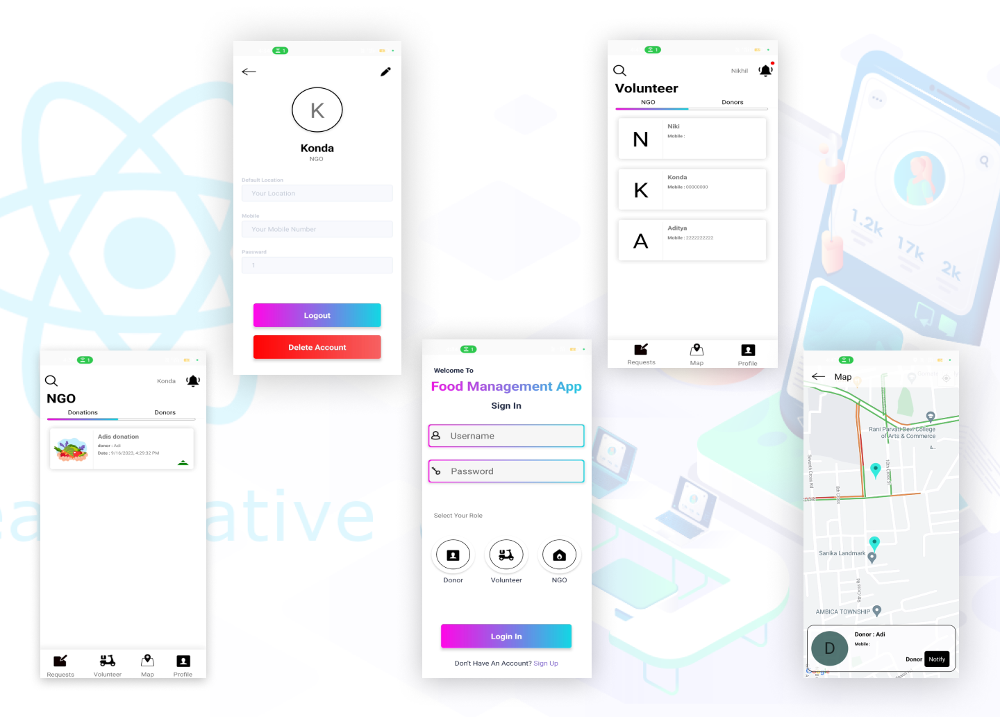
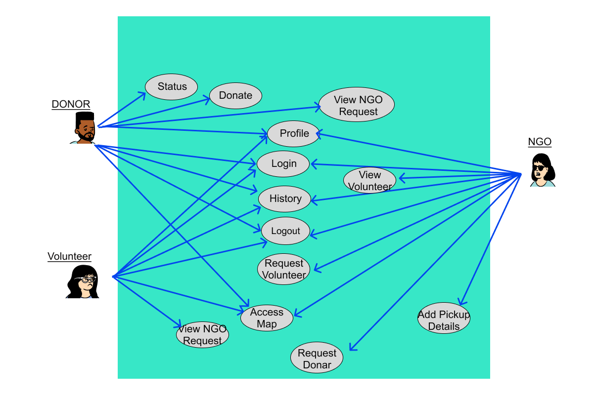
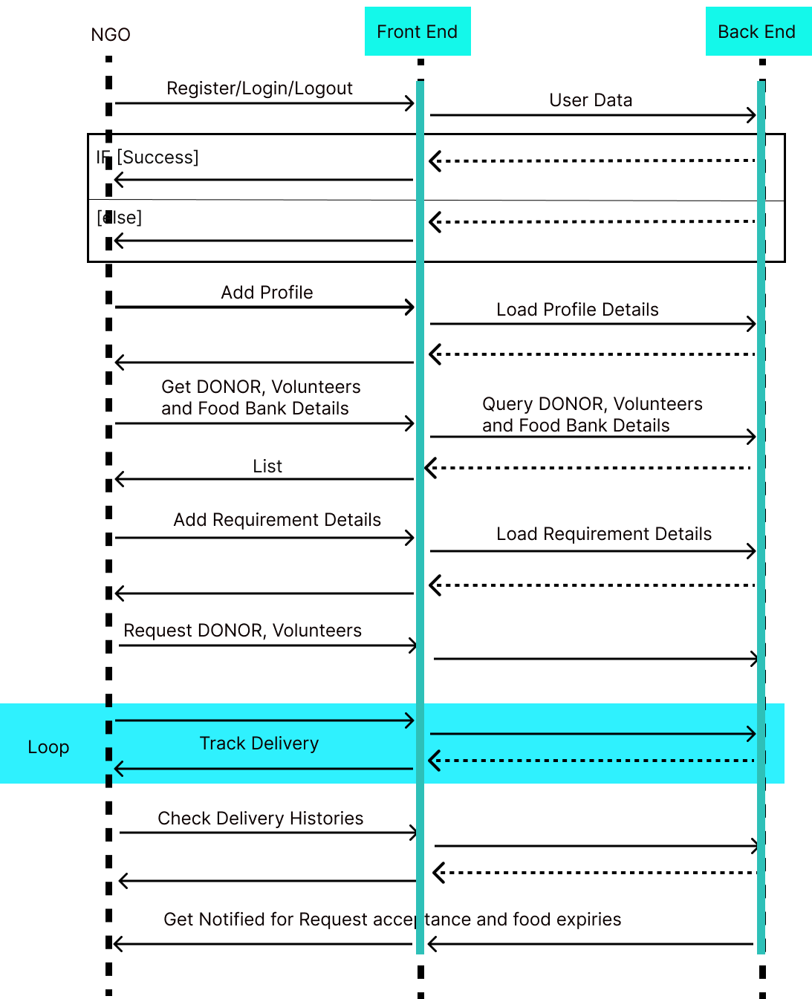
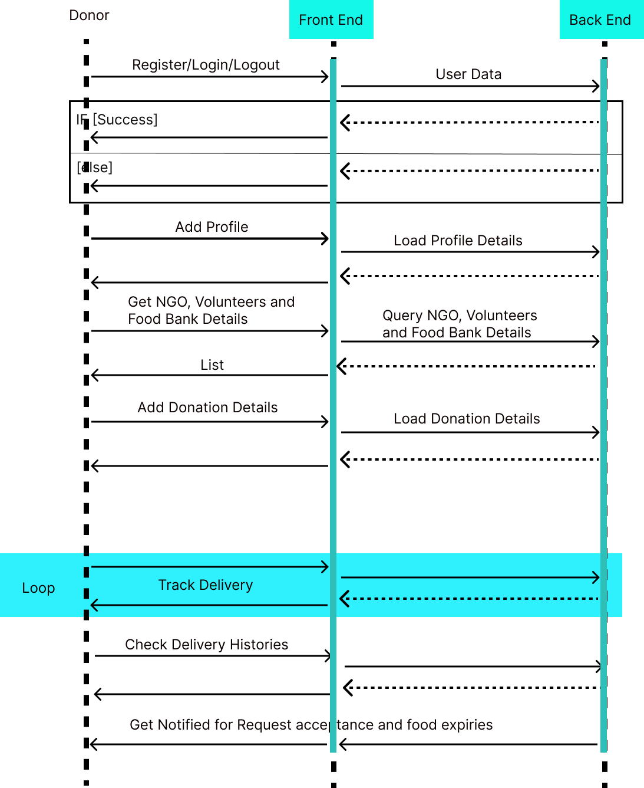
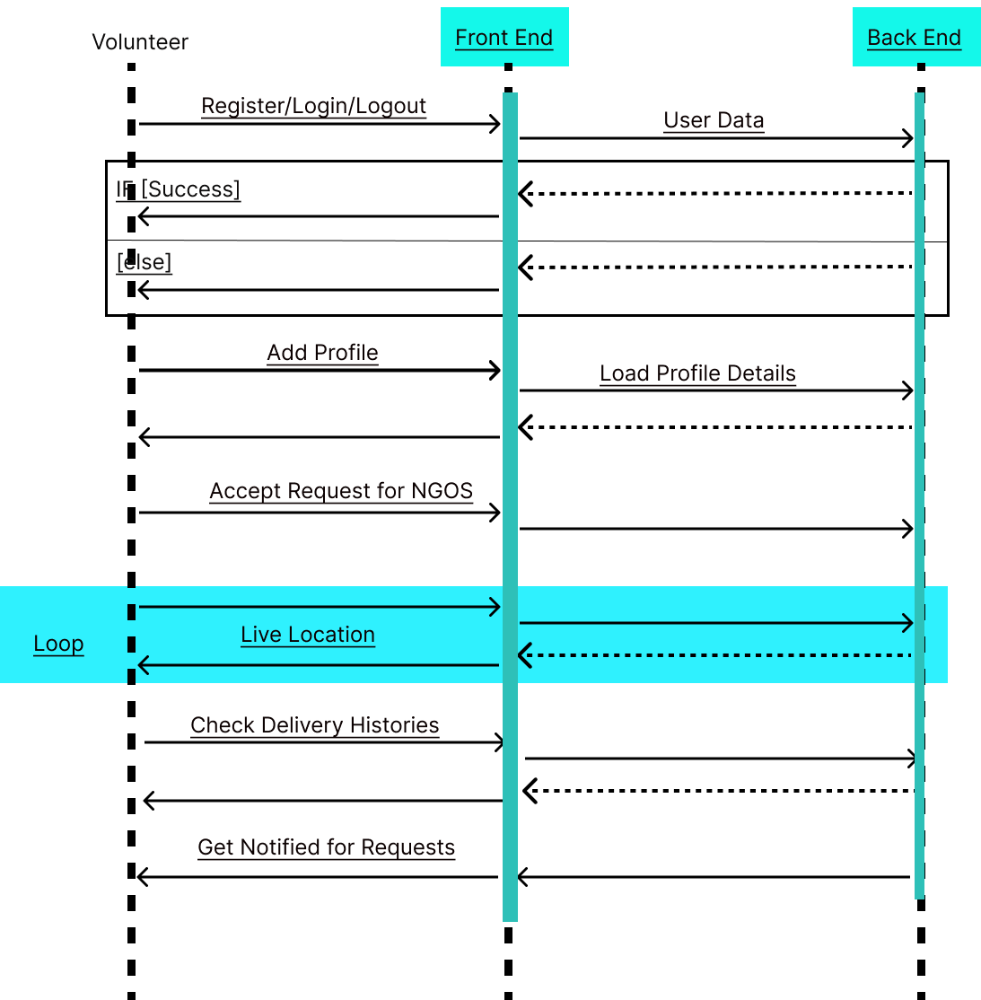
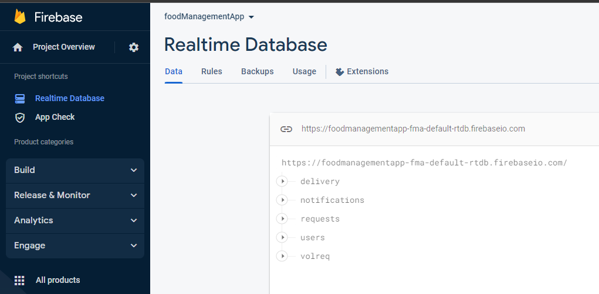

# foodManagementApp
React Native App that connects NGOs with Food Suppliers and Volunteers



#### Problem Statement - A User friendly platform for food waste management and addressing the reduction of under-nourishment


### A Brief of the Prototype:
Everyday, tonnes of food in urban cities is thrown away because they could not be consumed before expiry. Food wastage not only has a big impact on the environment, but also could have been better used to feed communities in need. So, we can create a platform that connects food suppliers with non-profit organisations. The platform makes use of Map API optimise food rescue routes, minimize transportation costs, and maximize benefits to communities in need. Instead of throwing away food that is close to expiry, we can organise rescue efforts for these food items so that they can be redistributed to those in need. Collection and redistribution logistics are key, and the app will optimize timing and route transport so as to minimize transport costs while ensuring food does not sit around and spoil while waiting to be re-distributed to those in need.	

In this platform has three entities,
1. DONOR - Adds a donation , accepts NGO requests and has the ability to track volunteer.
2. NGO - Request for the donation to donor , Request volunteer to deliver the donation and has the ability to track volunteer.
3. VOLUNTEER - Extract Donor or NGO information , Accept the request from volunteer , Get access to location points of donor or NGO to continue with the delivery.

Who owns this problem? Or whose problem are you solving?
1. The project is owned by volunteers who wish to donate food to needy organizations.
2. There is a drastic increase in food wastage. As per data given by Food and Agriculture Organization 1/3rd of food produced
for human consumption is wasted globally, which accounts for almost 1.3 billion tons per year. On the other hand, As per
WHO 20% of the population faces extreme food scarcity. Hence, this solution is for those who are in a need of food.
3. No food waste is the mission of this system
4. The app simplifies the job of the social worker by finding the need of food in different areas of the country.
5. We are solving the problems of the food suppliers by helping them out to save food, I am helping out NGOs to feed the
under nourished ,I am providing an interface to the volunteers to simplify their work and reducing the disposal or waste food piles.

#### USE CASE Diagram :
The Use
Case Diagram depicts the general use cases that
will get integrated into the project. The app will start
with the initial signup/ signin . The users get access to the
NGOS, Food Donors or donation details. The users can
track the activities of the delivery process. The volunteer
can deliver with minimum travelling cost as the platform
makes the other entites to choose the nearest volunteer
to complement the delivery.
The app will be flexible for addition of new features.

#### Sequence Diagram :
The Donor can perform all the operations shown in the diagram .
The Donor can track the operations happening in the platform.
Check whether the food is delivered properly. 
The NGO gets different ways to get the food which would
otherwise go waste. NGOs can track the live deliver of food and
also contact the volunteer.
The volunteers are heart of the system , so this platform provides
them the optimized route and also gives suggestion of the
environment of path(climate, traffic) that is chosen for delivery.
##### DONOR :
  
##### NGO :
  
##### VOLUNTEER :
    
### Tech Stack: 
   1. Front End - React Native with react-native-maps , react-native-geolocation-service , react-native-ui-kitten.
   2. Back End - Firebase through react-native-firebase 
   
### Step-by-Step Code Execution Instructions:
  1. Setup the environment for React-Native for windows as development system and android as target system following this https://reactnative.dev/docs/environment-setup?guide=native
  2. Clone this REPO and navigate to foodManagementApp folder
  3. Run the App on an Emulator or Physical Device:
        To run your app on an emulator or a physical device, you can use the following command. Make sure you have an Android or iOS emulator set up or a physical device connected following https://reactnative.dev/docs/environment-setup?guide=native .
     ```
     npx react-native run-android
     ```
(Optional) Create a Firebase Project:

1. Go to the Firebase Console (https://console.firebase.google.com/).
Click on "Add Project" and follow the setup wizard.
Choose a project name and select a region for your project.
Set Up Authentication:

2. In the Firebase Console, go to your project.
In the left sidebar, click on "Authentication" and enable the authentication methods you want (e.g., email/password, Google, Facebook, etc.).
Follow the setup instructions for each authentication method.
Set Up a Database:

3. Firebase offers two types of databases: Realtime Database and Firestore. We are using Realtime Database
In the Firebase Console, go to your project.
Click on "Database" and set up the database according to your choice (Realtime Database or Firestore).
Configure the security rules for your database to control access.
###### Note : The Firebase configuration is already done in the project

In firebase, we are adding properties to the realtime database. 

1. notification - for user notification
2. users - to maintain user profiles
3. volreq - So that volunteer can check the requests from NGO and also get the pickup , drop points for delivery
4. requests - The request from NGO to Donor can be tracked here
5. delivery - to store the live location of all the volunteer to share with other entities
6. 
### Future Scope:
   The future scope of a food management app includes sustainability and health features, personalization, IoT integration, food delivery, social interaction, AR/VR experiences, blockchain for food traceability, food waste reduction, restaurant and catering integration, international cuisine expansion, voice interaction, multi-platform support, data security, AI cooking assistants, and partnerships for growth and innovation. These developments will cater to changing consumer needs and technological advancements in the food industry.
   Image in terms of social consequences :
1. Reducing food waste:
By helping users keep track of their food inventory and usage, this app can reduce the
amount of food that goes to waste. This can have a positive impact on the environment by reducing greenhouse
gas emissions from landfills and conserving natural resources.
2. Supporting local communities:
This apps connect users with local restaurants and grocery stores that have surplus
food to NGOs and food banks
3. Opportunity of the volunteers :
The people interested in social work can login the app and request for being the
partner of NGOs or Food Banks for delivery.
4. Awareness : The NGOs and Food Banks get the awareness of the surplus food from the food suppliers.
